## Rectifying Non-Stereo Images to Make Anaglyphs

This repository uses two images of a scene to create an anaglyph.  Instead of using images taken with a stereo set up, the two images can be taken with a handheld camera.  The images are then rectified to create an anaglyph that appears 3D when viewed with red/cyan glasses.

The results below use Scale Invariant Feature Transform (SIFT) for feature detection combined with Fast Library for Approximate Nearest Neighbors (FLANN) for feature matching.

This project was completed as a Computational Photography assignment at Georgia Institute of Technology.

### Results

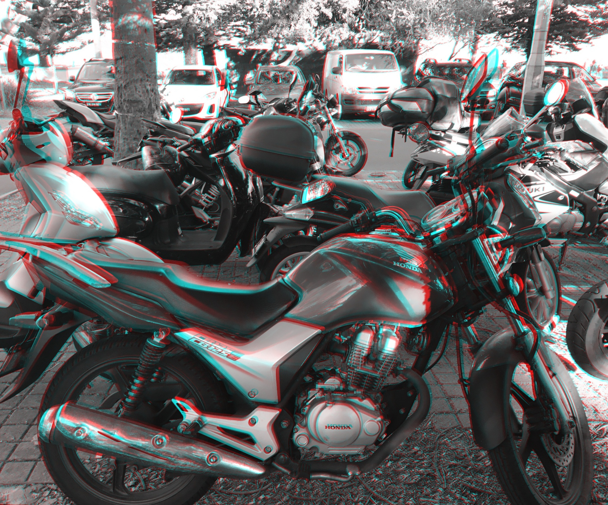 | 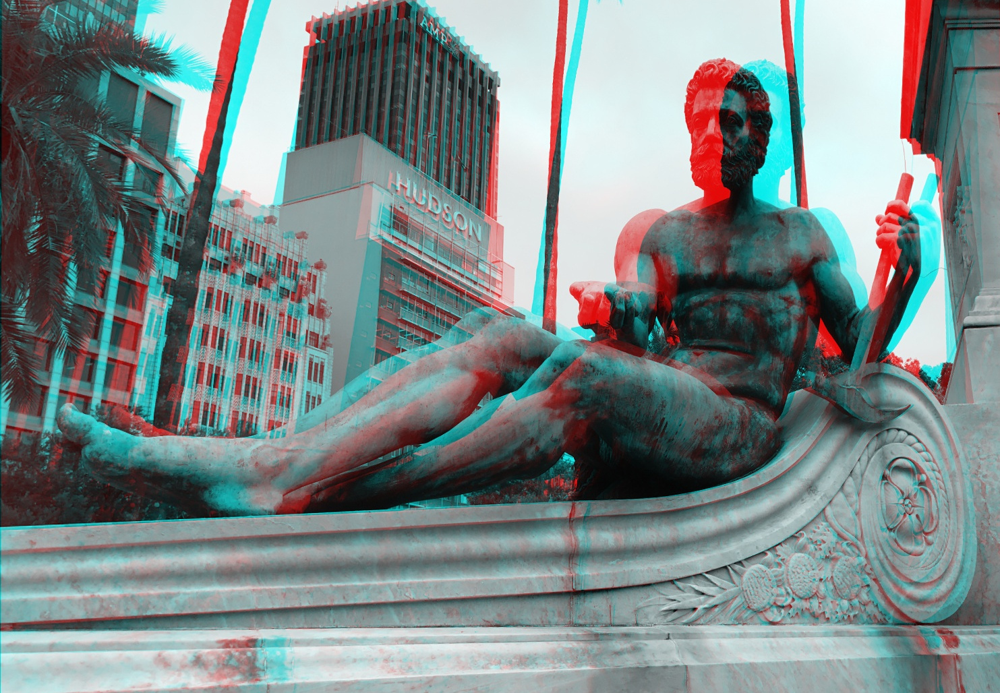 | 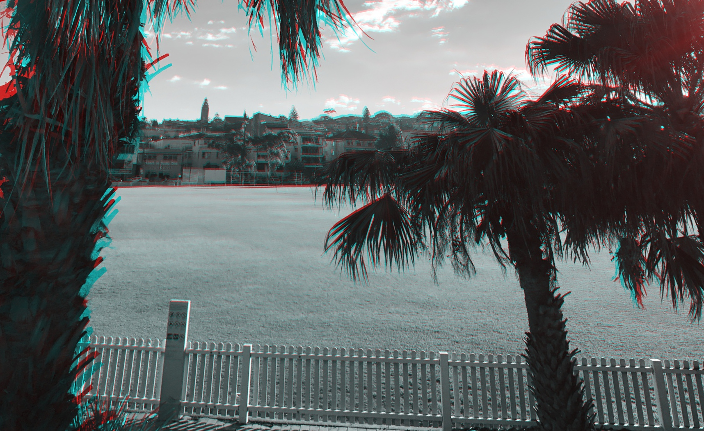

### Processing Pipeline
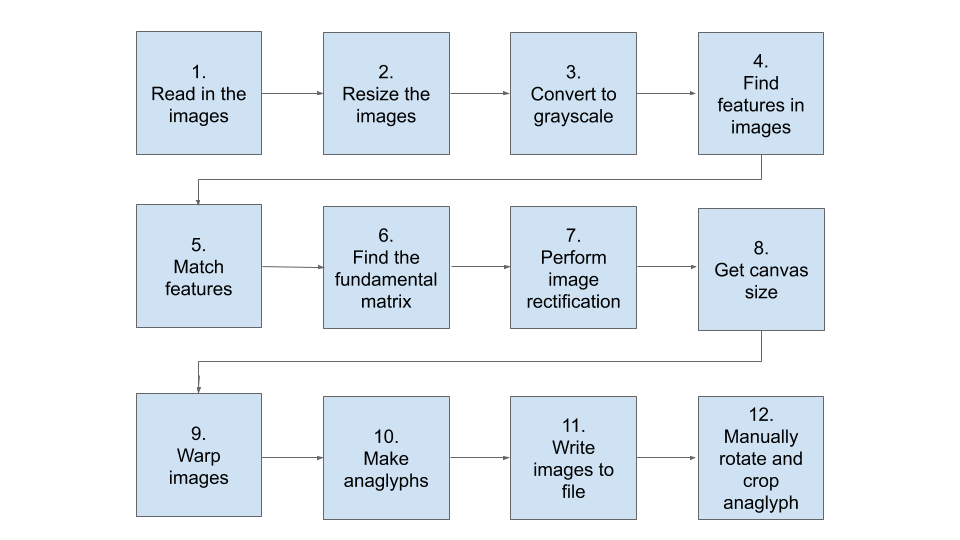
Motorbike example
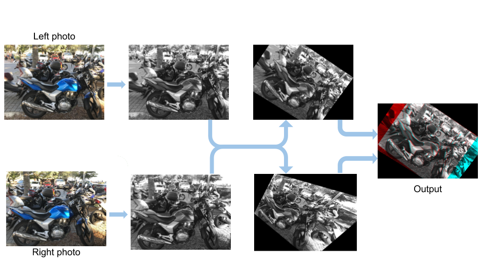

### Motorbikes

Left photo            |  Right photo
:-------------------------:|:-------------------------:
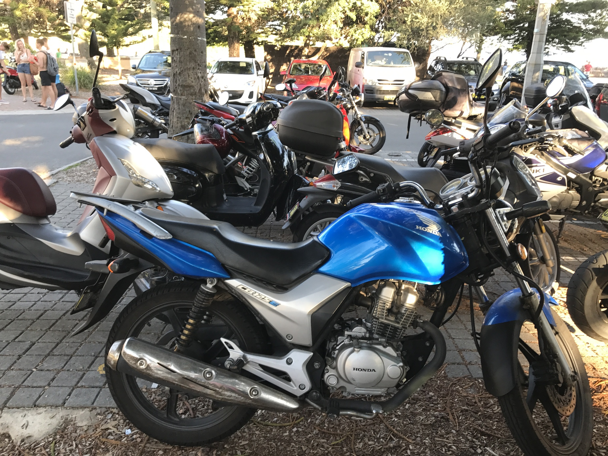 | 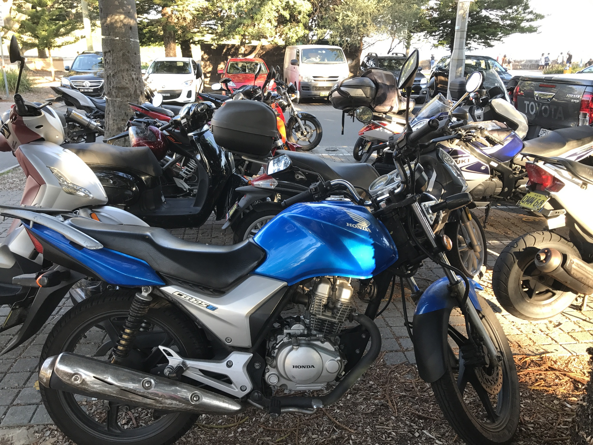 
:-------------------------:|:-------------------------:
Computed anaglyph            |  After rotation and cropping
:-------------------------:|:-------------------------:
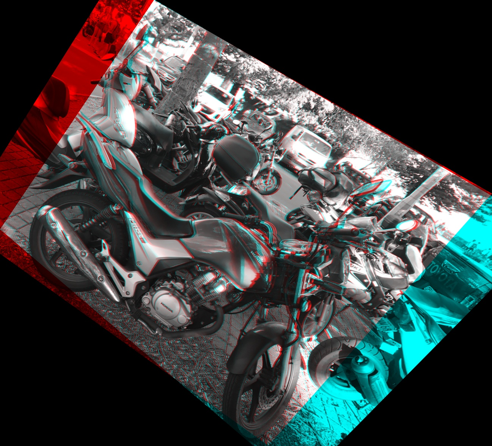 | 

### Cyclops statue
Left photo
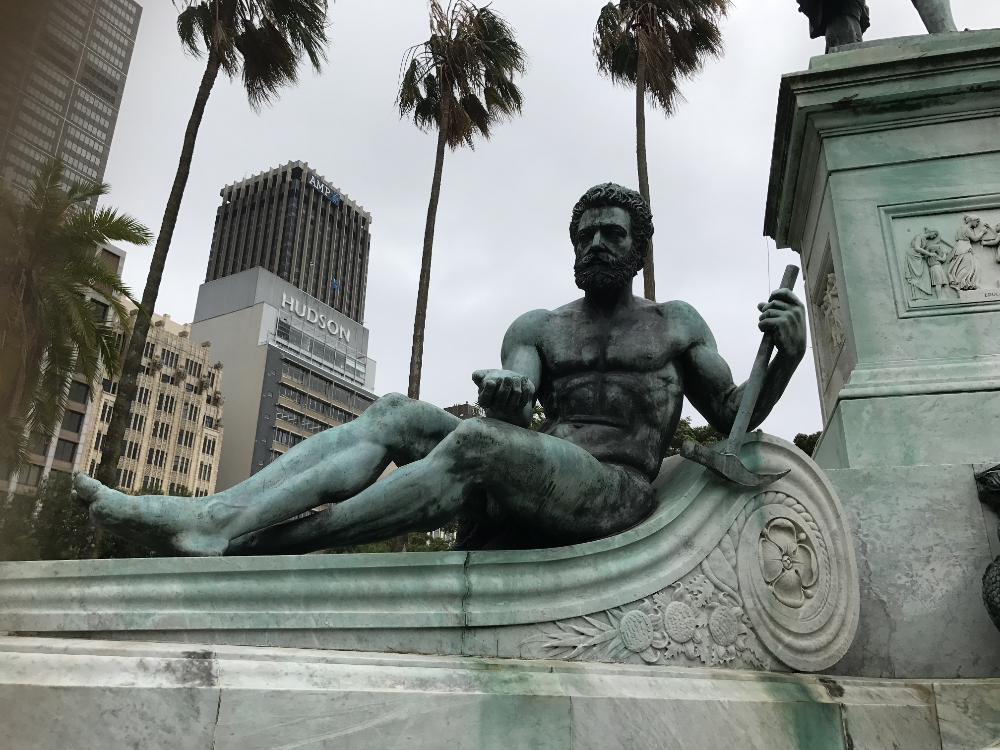
Right photograph
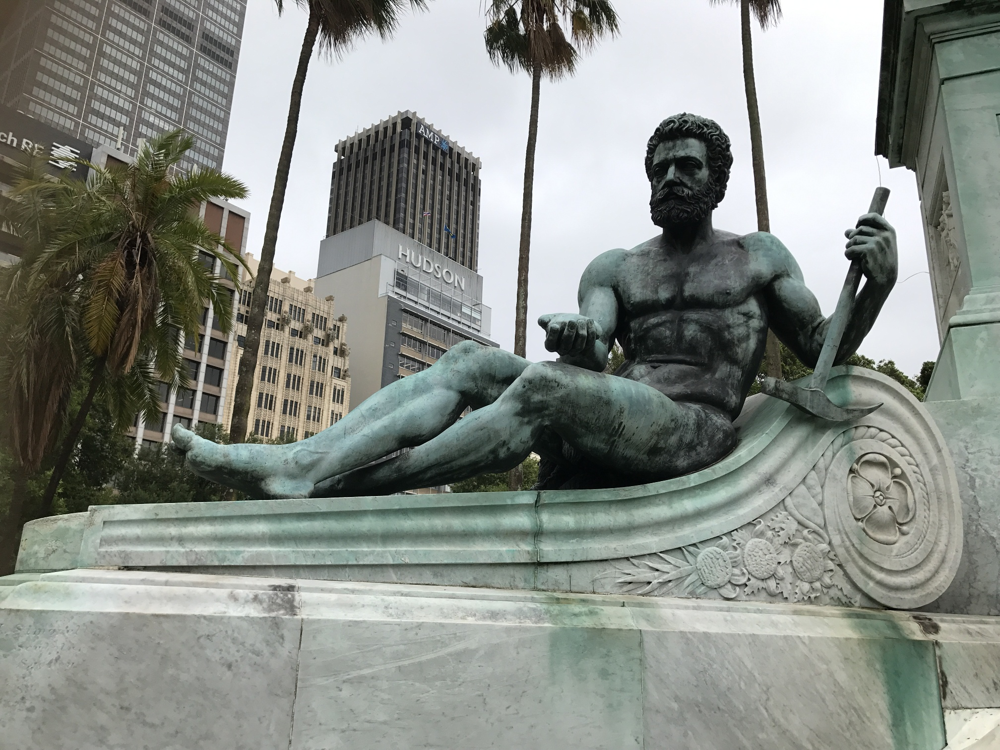
Anaglyph
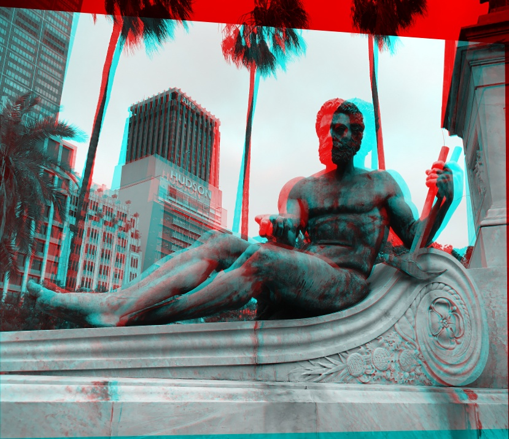
Final result after rotation and cropping

### Sports Oval
Left photo
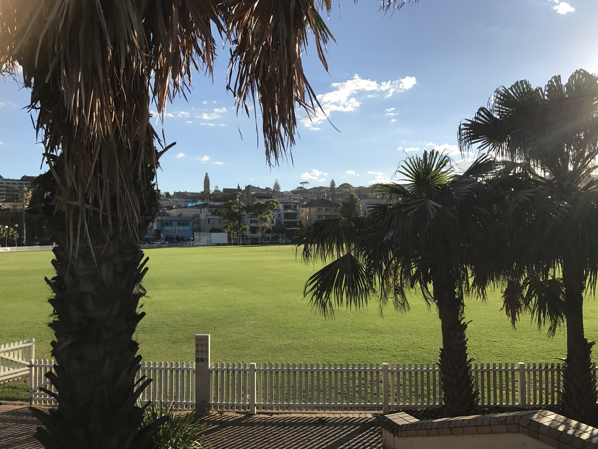
Right photo
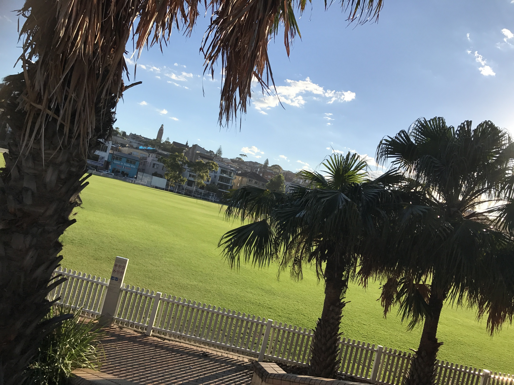
Anaglyph
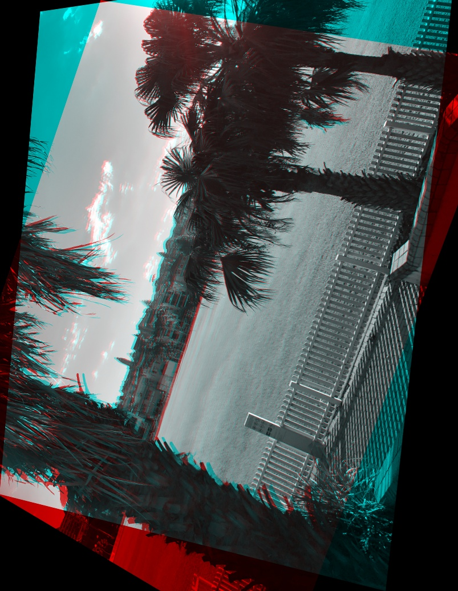
Final result after rotation and cropping

### References

Blue Lightning TV Photoshop, 2013, Photoshop Tutorial: How to Make Jaw-dropping, 3-D Anaglyphs from Photos, online video, accessed 27 Nov 2017, https://www.youtube.com/watch?v=Mh5qiCvaS0o

Hartley, R. and Zisserman, A., 2003. Multiple view geometry in computer vision. Cambridge University Press.

Loop, C. and Zhang, Z., 1999. Computing rectifying homographies for stereo vision. In Computer Vision and Pattern Recognition, 1999. IEEE Computer Society Conference on. (Vol. 1, pp. 125-131). IEEE.

Mathworks, Uncalibrated Stereo Image Rectification https://au.mathworks.com/help/vision/examples/uncalibrated-stereo-image-rectification.html

Middlebury Stereo Datasets http://vision.middlebury.edu/stereo/data/
Open CV 2.4 Documentation https://docs.opencv.org/2.4/

Open CV, Epipolar Geometry
https://docs.opencv.org/3.0-beta/doc/py_tutorials/py_calib3d/py_epipolar_geometry/py_epipolar_geometry.html

Solem, J.E., 2012. Programming Computer Vision with Python: Tools and algorithms for analyzing images. " O'Reilly Media, Inc.".

Wikipedia, Image Rectification, https://en.wikipedia.org/wiki/Image_rectification  Accessed 3 December 2017

https://stackoverflow.com/questions/36172913/opencv-depth-map-from-uncalibrated-stereo-system

https://stackoverflow.com/questions/20259025/module-object-has-no-attribute-drawmatches-opencv-python

https://stackoverflow.com/questions/41760798/opencv-python-stereo-match-py